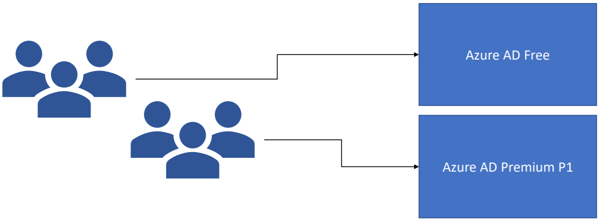

# Azure Active Directory B2B

## What is Azure Active Directory B2B?
- Used to share applications and services with guest users
- External org doesn’t need to have Azure Active Directory
- B2B uses an invitation and redemption process
- No need to manage external accounts or external passwords

## Azure AD B2B
- You can add guest users through the Azure AD portal
- Process is similar to that of adding an internal user
- App owners and group owners can manage their own guest users

## Azure AD B2B Licensing
- Guest users can use free Azure AD features without any additional licensing requirements
- You can invite up to five guest users for each paid Azure AD edition license that you are own
