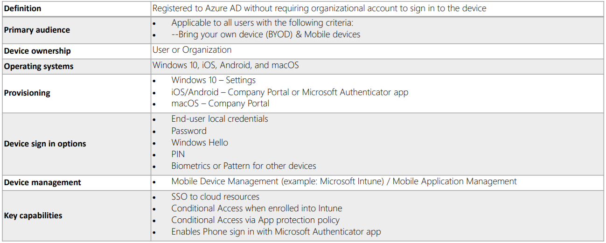
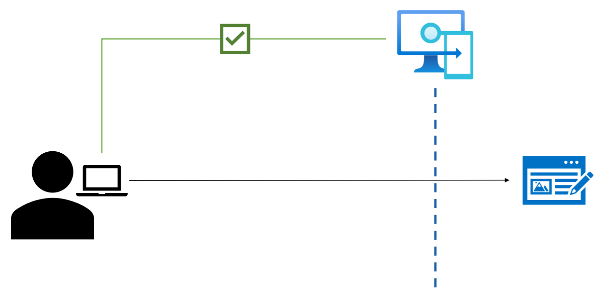
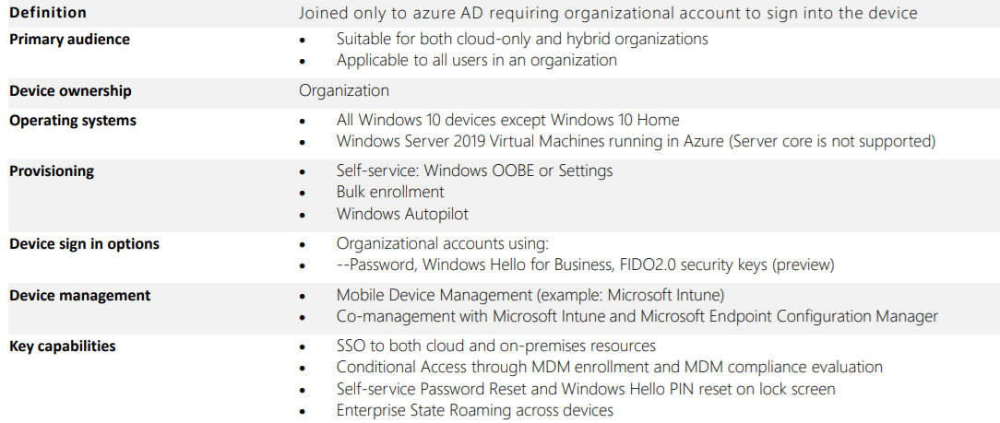
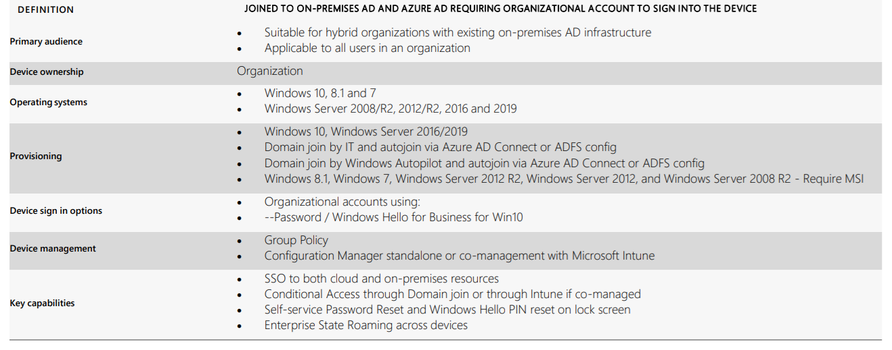

# Configuring and Managing Device Registartion

With the advent of BYOD, organizations want to allow end-users to be productive wherever they are located and whenever they are working, while also protecting their assets.

Organizations can use tools like Microsoft InTune to ensure that devices meet corporate security standards and compliance.

Leveraging Azure active directory enables single sign-on for devices, applications, and services from anywhere in the world, through these devices.

There are two ways to manage devices in Azure AD:
- Azure AD Registered Devices
- Azure AD Joined Devices (including Hybrid Join)

## Azure AD Joined Devices
Azure AD Join is designed for organizations that prefer to be cloud first or even cloud only.

Intended for organizations who wish to have a very small on-prem footprint or no on-prem footprint.

## Azure AD Registered Devices
Azure AD registered devices allow organizations to support BYOD scenarios.

Allows users to access Azure AD-controlled resources while using their own personal devices.

## Azure AD Joined Devices 
Designed for organizations that prefer to be cloud first or even cloud only.

For organizations who wish to have a very small on-prem footprint or no on-prem footprint at all.

Azure AD Joined devices can still authenticate to on-prem servers like **file servers**, **print servers**, and **application servers**. 

### Use Cases for Azure AD Joined Devices
Transition to a cloud-based infrastructure using Azure AD and Microsoft InTune.

Can’t use an on-prem domainjoin, but still need to get a handle on mobile devices, tablets, and phones.

Azure AD Join supports all Windows 10 devices except for those running Windows 10 home.
- Simplifies windows deployments of work-owned devices
- Simplifies access to organizational apps and resources
- Simplifies cloud-based management of work-owned devices
- Simplifies the sign in process for users to their devices 

Users can take advantage of selfservice to join new Windows 10 devices to Azure AD during the first run experience when the machine is booted up for the first time.
- Device registration service must be configured
- Permissions must be configured
- Fewer devices registered than configured maximum

## Hybrid Azure AD Joined Devices
Hybrid Azure AD joined devices are joined to an on-prem Active Directory, and are registered with Azure AD.
- An organizational account is required to sign into a Hybrid Azure AD joined device.
- Organizations that have an on-prem Active Directory footprint will often use Hybrid Azure AD joined devices.

If you already have an on-prem AD footprint that you still need, using Hybrid Azure AD Joined devices will allow you to also benefit from the capabilities that are provided by Azure Active Directory.

***