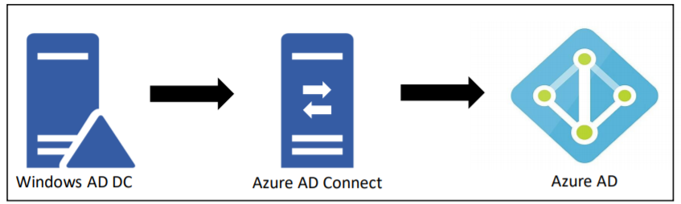
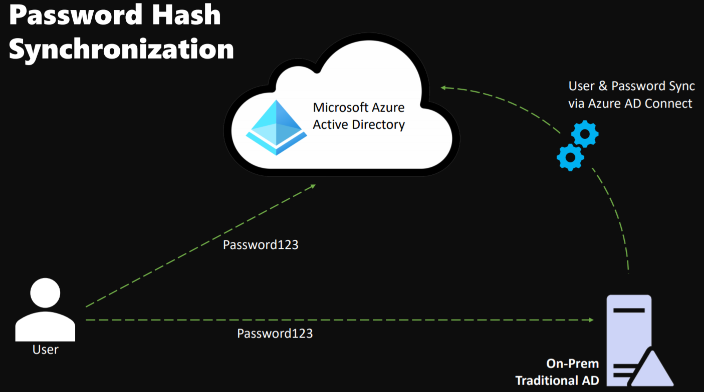
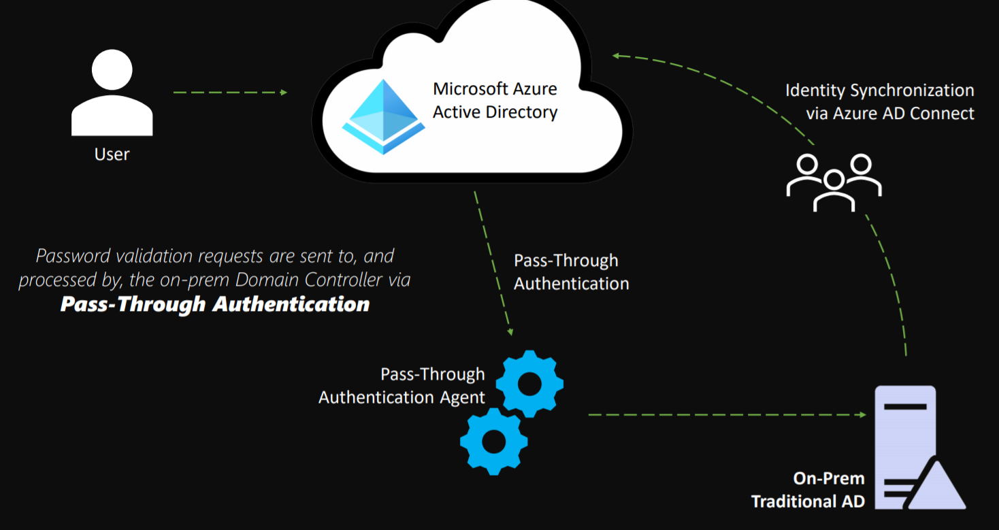
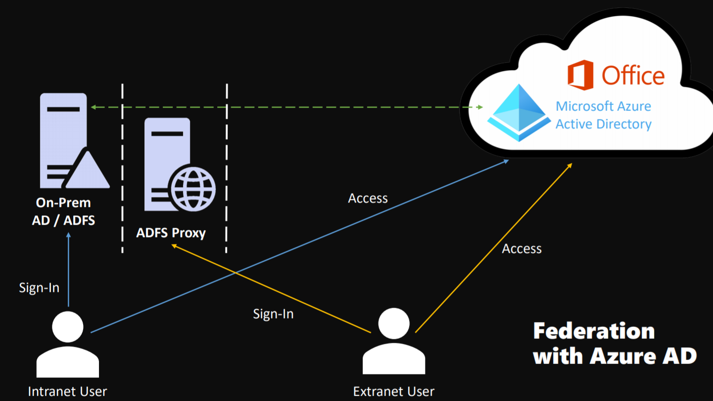

# Hybrid Identities
## What is Hybrid Identity?
Because organizations are relying more and more on a mixture of on-prem solutions and cloud solutions, it has become necessary to ensure users have access to both those onprem solutions and those cloud solutions. 
**Hybrid Identity** is Microsoft’s identity solution that can span on-prem and cloud. It creates common user identities that are used for authentication and authorization, regardless of where the user is located.

## The 3 Hybrid Identity Method
1. Password hash synchronization (PHS)
2. Pass-through authentication (PTA)
3. Federation

# Intro to Azure AD Connect
Azure AD connect is a software tool that is used to facilitate hybrid identities. It is used to configure:
- Password Hash Synchronization
- Pass-through Authentication
- Federation Integration
- Synchronization
- Health Monitoring

## Azure AD Connect
- Password Hash Synchronization:
    - Synchronizes a hash of your onprem AD user passwords with Azure AD
    - Allows your users to sign into cloud solutions using their onprem passwords
- Pass-through Authentication:
    - Allows users to use their onprem passwords in the cloud
    - Does not require the infrastructure of a federated environment
- Federation Integration:
    - An optional feature included with Azure AD connect
    - Used to leverage an on-prem ADFS infrastructure to configure a hybrid environment
- Health Monitoring:
    - Provides robust monitoring of the Azure AD connect deployment
    - Provides a central location in your Azure portal to view the health of Azure AD connect
- Organizations typically deploy Azure AD connect so that their users can use the same identity to access not only the on-prem applications but also cloud services like Office 365.
- Azure AD connect is free and included in all Azure subscriptions

## Azure AD Connect Health
Offers robust monitoring of the onprem identity infrastructure:
- Helps maintain a reliable connection to Microsoft online services
- View monitoring data in the Azure

AD connect health portal Requires installation of an agent on each on-prem domain controller.
Azure AD connect health requires an Azure AD Premium P1 license.

# PHS vs PTA Authentication
## Password Hash Synchronization
Password hash synchronization is probably still the most common sign-in method used when hybrid identities are required.
- Azure AD connect synchronizes a hash of the hash of user passwords
- Simplifies sign-on to services like Office 365
- Password hash synchronization helps reduce helpdesk costs
- A good backup to federation with Active Directory federation services 

Deploying password hash synchronization is
straightforward:
-  Deploy Azure AD connect
- Set up synchronization
- Select the password hash synchronization sign in method

Azure AD connect will synchronize on-prem users to Azure Active Directory, along with the hash of the hash of their passwords.

## Pass Through Authentication
Pass through authentication provides the same benefit of cloud authentication that password hash synchronization offers, but in a much different way.
- Provides password validation against the on-prem environment
- Requires software agents to be installed on the on-prem domain controllers
- The on-prem servers validate users directly with the on-prem AD
- Password validation is not performed in the cloud

Pass through authentication is the solution of choice for organizations with security requirements that mandate immediate enforcement of on-prem user account states, password policies, and sign in hours.

Pass through authentication can be used with the seamless single sign-on feature as well.

Pass through authentication allows users to access applications from their corporate machines inside the corporate network without the need to retype their passwords.

# Federation with Azure AD\
Federation is a collection of domains that trust each other.
- Typically involves one or more organizations.
- Used for authentication and for authorization.

To Federate an on-prem Active Directory Federation service with Azure AD, you can use Azure AD connect.
- Users can sign-in to Azure AD based services using on-prem passwords.
- Users don't have to re-enter their passwords if on the corporate network.

While **Federation** does offer enhanced control, it does involve quite a bit of additional hardware. The hardware required is used to configure an ADFS farm that Azure Active Directory will federate with.

https://docs.microsoft.com/en-us/Azure/active-directory/hybrid/how-to-connect-fed-whatis for more info.

https://aka.ms/sspr - password reset
***