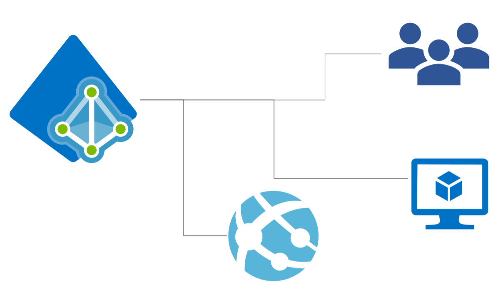
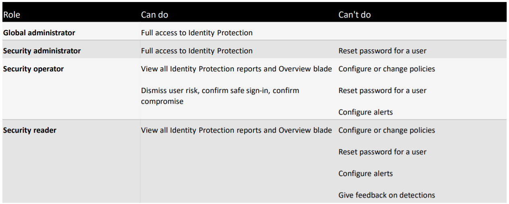
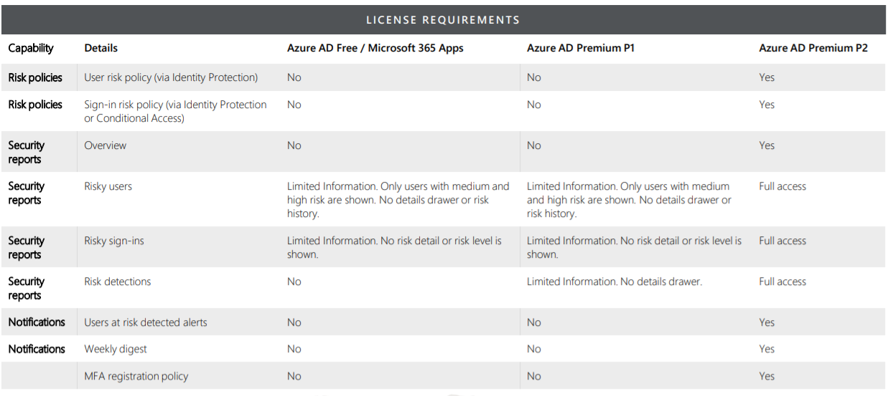

# Identity Protection

**Azure Identity** Protection is a tool that allows organizations to accomplish several tasks:
- Automate detection & remediation of identity-based risks
- Investigate risks using data in the portal
- Export risk detection data to third-party tools

It Identifies the following types of risk:
- Anonymous IP address
- Atypical travel
- Malware linked IP address
- Unfamiliar sign-in properties
- Leaked Credentials
- Password spray
- New country
- Activity from anonymous IP address
- Suspicous inbox forwarding

It has Risk signals picked up by Identity Protection can trigger remediation efforts:
- Perform Azure AD MFA
- Self-Service Password Reset
- Account Blocking

There are 3 key reports that administrators can use for investigations in Identity Protection:
- Risky users
- Risky sign-ins
- Risk detections

## Azure Identity Protection
- Security Reader
- Security Operator
- Secuirty Administrator
- Global Reader
- Global Administrator

Identity Protection needs P2 License.

**Azure Identity Protection** is a tool that allows organizations to accomplish several tasks:
- Automate detection & remediation of identity-based risks
- Investigate risks using data in the portal
- Export risk detection data to third-party tools

***