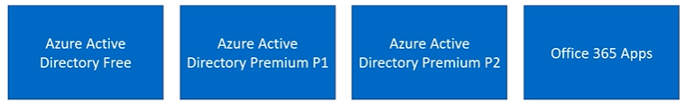
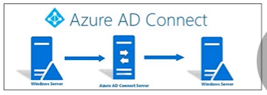

# An Intoduction to Azure Active Directory

AD So what exactly is Azure Active Directory as are Active Directory is a cloud based identity and access management service.

Allow users to:
- It's used to allow users to sign in and to access resources.
- It can be used to provide access to internal resources like applications on the corporate network, as well as cloud apps that you've developed.

Who uses Azure AD?
- IT Administartors
- Application Developers
- Subscribers

## Who Uses Azure AD?

- IT Administators
    - Uses AZure AD to control to access to apps and resources.
    - Enforce multifactor authentication.
    - Automate user provisioning.
- Application Developers
    - Adding single sign-n to applications
    - Allow applications to work with the existing credentials for users.
- Subscribers
    - Microsoft 365 & Office 365 suscriptions are already automatically Azure AD tenantes because user access to these apps are controlled by Azure AD.

## Azure AD Licenses
- Azure AD is offered in a free version and paid versions.
- Paid Azure AD licenses provide additional benefits:
     - Self-service
     - Enhanced monitoring
     - Security
     - Reporting
     - Secure access for mobile users.

## Azure Active Directory Free
- Offers User & Group Managment
- Offers On-Prem Directory Synchronization

- Offers Some Basic Reporting Functionality
- Self-Serive Password Change for Cloud-Only Users.
- Single Sign-On for Azure, Office 365, and Other SaaS Apps

## Azure Active Directory Premium P1
- Offers everything the free version offers.
- Also offers some advanced administration capabilities.
    - Dynamic groups
    - Self-service group managment
    - Self-service password reset for on-prem users.
    - Microsoft Identity Manager.

## Azure Active Directory Premium P2
- Builds off the version and premium P1
- Offers Azure Active Directory Identity Protection
    - Used to leverage risk-based conditional access to applications & data
- Privileged identity management
    - Restrict and monitor the access and activities of administrators.
    - Just-in-time access

## Office 365 Apps 
- Offers users and group managment, user-based provisioning, and basic security and usage reports.
- Limited sign-on capabilities, along with self-service password reset for cloud-only users.

## Key Terms

- `Identity` - A thing that can get authenticated. An identity can be a user with a username and password. Identities also include applications or other servers that might require authentication through secret keys or certificates.
- `Azure AD Account` - An identity created through Azure AD or another Microsoft cloud service, such as Microsoft 365. Identities are stored in Azure AD and accessible to your organization's cloud service subscriptions. Sometimes called a Work or school account.
- `Azure AD Directory` -  Each Azure tenant has a dedicated and trusted Azure AD directory. The Azure AD directory includes the tenant's users, groups, and apps and is used to perform identity and access management functions for tenant resources.
- `Azure AD Global Administrator` - This administrator role is automatically assigned to whomever created the Azure AD tenant. Global administrators can do all of the administrative functions for Azure AD and any services that federate to Azure AD, such as Exchange Online, SharePoint Online, and Skype for Business Online. You can have multiple Global administrators, but only Global administrators can assign administrator roles.

## Azure AD Features
- Application management features
    - Application proxy
    - Single sign-on
    - My apps portal
- Authentication features
    - Self-service password reset
    - Multifactor authentication
    - Banned password lists
    - Smart lockout

## More Azure AD Features
- Hybrid identity features
    - Azure Active Directory Connect & Connect Health
        -Used to provide a single user identity that each user can use for authentication and authorization to your resources
- Various reporting and monitoring features
    - Provide insights into the security and usage patterns within your organization
- Privileged Identity Management (PIM)
- Manage, control, and monitor access to resources 

***