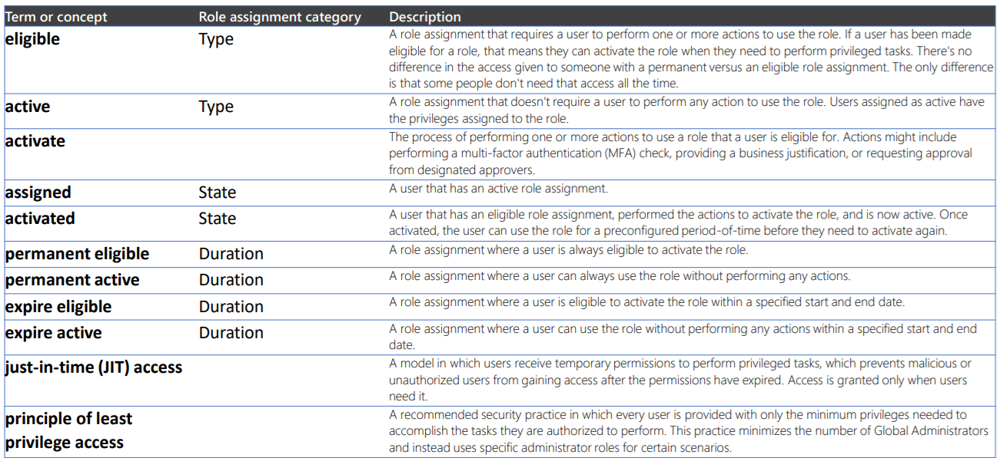

# Privileged Identity Managment

Privileged Identity Management is an Azure AD service that is used to manage, control, and monitor access to critical resources.

## PIM Use Cases
PIM is useful to organizations that want to minimize the number of people who have access to critical information or resources.
- Reduces the chance of a malicious actor getting that access
- Reduces chances of an authorized user impacting a sensitive resource
- Allows just-in-time privileged access to Azure resources and Azure AD
- Provides oversight for what users are doing with admin privileges

## Key Features of PIM:
- Provide just-in-time privileged access to Azure AD and Azure resources
- Assign time-bound access to resources
- Require approval to activate privileged roles
- Enforce MFA to activate any role
- Use justification to understand activations
- Notifications when privileged roles activated
- Conduct access reviews
- Download audit history

## Privileged Identity
Management As an administrator, you can choose to manage Azure AD roles, Azure resource roles, or privileged access groups. 

Privileged Role Administrator Permissions:
- Enable approval for specific roles
- Specify approver users or groups to approve requests
- View request and approval history for all privileged roles

Approver Permissions:
- View pending approvals
- Approve or reject requests for role elevation
- Provide justification for my approval or rejection

Eligible Role User Permissions:
- Request activation of a role that requires approval
- View the status of your request to activate
- Complete task in Azure AD if activation approved

https://docs.microsoft.com/azure/active-directory/privileged-identity-management/subscription-requirements

***