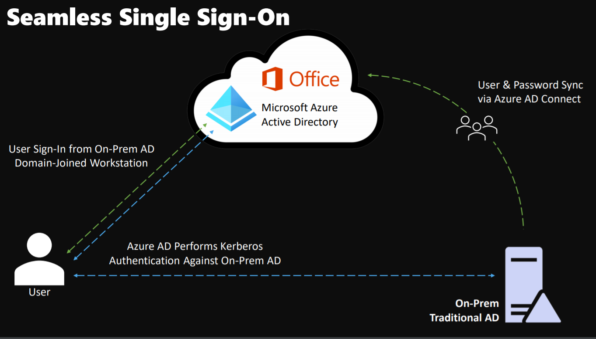

# Seamless Single Sign-On

Automatically signs users in when using a corporate device while connected to corporate network.
- Users don’t have enter passwords to sign into Azure AD
- Makes it easier for end-users to access cloud-based applications

## Single Sign-On
Single Sign-On can be achieved via **Primary Refresh Token** OR via **Seamless SSO**.

When using Windows 10, Microsoft recommends using SSO via primary refresh token. If you are still using Windows 7 or Windows 8.1, Microsoft recommends using Seamless SSO. 

## Seamless SSO
- Seamless SSO requires the user's device to be domain-joined.
- Seamless SSO is NOT used on Windows 10 Azure AD-joined devices or ON hybrid Azure ADjoined devices.
- Azure AD-joined, Hybrid Azure ADjoined, and Azure AD registered devices use the Primary Refresh Token option.

Because users are automatically signed into both on-prem apps and cloud-based apps, they don't have to enter their passwords repeatedly. 

Easy to deploy and manage. Can be rolled out via Group Policy. 

Register non-Windows 10 devices with Azure AD without the need for an ADFS infrastructure.

https://docs.microsoft.com/en-us/azure/active-directory/hybrid/how-to-connect-sso-how-it-works - for more details

